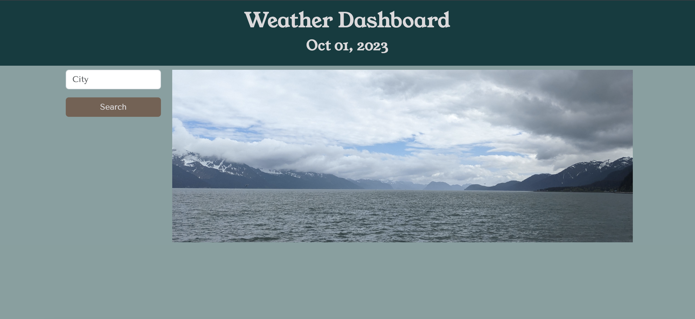
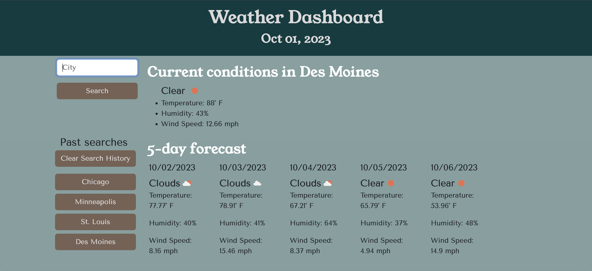

# Weather Dashboard

## Description
This application is an online weather dashboard. It allows a user to submit the name of a city, and then displays the current weather conditions and the 5-day forecast for that city. It saves the user's search history (and allows the user to clear that search history if desired), so that they only need to click the appropriate button to see weather information for that city again.

## Screenshots

Initial page:

Page showing search results and history:

## Link to live site

https://bdeutmeyer.github.io/weather-dashboard/

## Technologies used

This application was built using HTML, CSS, and JavaScript. I utilized Bootstrap and Google Fonts APIs for styling. I used Day.js to display the current date at the top of the page, and to target the correct dates/times out of the weather data. The weather data was sourced through the Open Weather API.

## Credits

Credit for guidance always goes to my teaching staff, tutor, and Google, but all code is my own. The photograph is as well. All weather data comes from the Open Weather API.